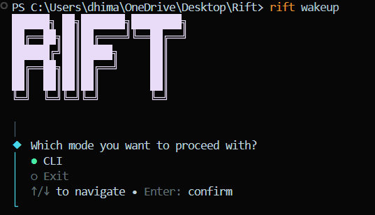
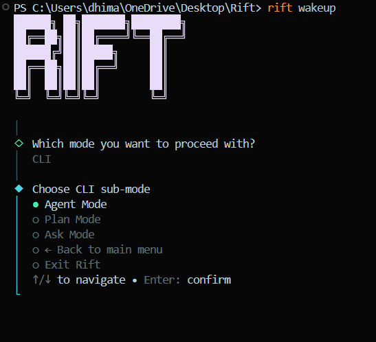

# Rift

**v1** — Rift is a CLI coding agent that stages changes before writing them, shows you exactly what it wants to do, and waits for your approval. Your code, your control.

## Why "Rift"

A rift is the gap between your codebase as it is and what you want it to be. Every developer knows that gap — the function that needs refactoring, the error handling that never got added, the tests that don't exist yet. You know what needs to change, but getting there is the hard part.

Rift lives in your terminal, reads your codebase, and closes that gap. No remote control, no phone — just you, your terminal, and an agent that reasons before it touches your files.

<p align="center">
  
  
</p>

## Modes

- **Agent Mode** — give it a goal; it plans and executes using file/shell tools, then asks for approval before applying any changes.
- **Plan Mode** — drafts a multi-step plan first (with an optional research pass), lets you pick which steps to run, then executes them one by one.
- **Ask Mode** — read-only Q&A over your codebase (and the web, if configured); can save the answer to a `.md` file.

## How it actually works

Rift never writes to disk or runs a shell command as a side effect of the model "deciding" to. Every mode goes through the same pipeline:

```
LLM tool call → ToolExecutor (staged in memory) → ActionTracker (logs it) → your approval → written to disk
```

1. **Staging.** When the agent calls a tool like `create_file` or `modify_file`, `ToolExecutor` (`modes/agent/tool-executor.ts`) doesn't touch the real filesystem. It writes into an in-memory overlay (a `Map` of path → pending content) and records the action in an `ActionTracker` with status `"pending"`. Read tools (`read_file`, `list_files`, `search_files`, ...) *do* run immediately, since they're side-effect-free — but even reads check every path against a workspace sandbox first.

2. **Sandboxing.** Every path goes through `resolveSafe()`, which resolves it against the workspace root and rejects anything that escapes it — including via a symlink that *looks* like it's inside the workspace but actually points elsewhere (`fs.realpathSync` catches that). File and folder names are also checked against Windows-illegal characters/reserved device names on every OS, so nothing the agent creates breaks if the repo is ever opened on Windows. `excludePatterns` are matched case-insensitively with real glob support and cover dependency/build folders across ecosystems (`node_modules`, `venv`/`.venv`, `__pycache__`, `target`, `vendor`, `.git`, `dist`, `*.log`, `.env*`, ...), so the agent can't wander into files it shouldn't touch.

3. **Context protection.** Every tool result returned to the model is hard-capped in size — a runaway recursive listing or a giant file can't flood the model's context window and kill the run. When output is clipped, the model is told to narrow its query instead. And if an API call does fail mid-run, the error is caught, staged changes are discarded, and you're returned to the menu — no crashes.

4. **Review.** Once the agent finishes (or a plan step finishes), `runApprovalFlow()` (`modes/agent/approval.ts`) shows you every *pending* mutation, grouped by file. You can approve everything at once, or go one-by-one and inspect an actual unified diff for each file (built with the `diff` package's `createTwoFilesPatch`, rendered as syntax-highlighted markdown in the terminal) before accepting or rejecting it.

5. **Apply.** Only actions marked `"approved"` are ever written for real — `applyApprovedFromTracker()` writes files, creates folders, and runs any approved shell commands (via `spawnSync`, using `cmd.exe` explicitly on Windows). Anything rejected or left pending is discarded when the staging overlay is cleared.

Plan Mode adds one extra step in front of this: `planner.ts` runs a *read-only* pass over the codebase (and the web, via Firecrawl, if configured) to draft a structured, numbered plan before any mutation tools are even offered to the model.

## Tech stack — what's used and why

| Tool | Role |
|---|---|
| [Bun](https://bun.com) | Runtime + package manager. Runs TypeScript directly, no build step. |
| TypeScript (strict mode) | The whole codebase — catches the exact class of `undefined`/type bugs that matter most in file/path handling. |
| [`commander`](https://www.npmjs.com/package/commander) | CLI entrypoint/argument parsing (`index.ts`) — defines the `rift wakeup` command. |
| [`@clack/prompts`](https://www.npmjs.com/package/@clack/prompts) | All interactive terminal UI: menus (`select`), text input, confirmations, and the loading spinners shown while the agent is working. |
| [`ai`](https://www.npmjs.com/package/ai) (Vercel AI SDK) | The agent runtime — `ToolLoopAgent` drives the read-tool-call-repeat loop, `generateText` + `Output.object` drives Plan Mode's structured JSON plan output. |
| [`@openrouter/ai-sdk-provider`](https://www.npmjs.com/package/@openrouter/ai-sdk-provider) | Connects the AI SDK to [OpenRouter](https://openrouter.ai), so Rift isn't locked to one model provider — swap `OPENROUTER_DEFAULT_MODEL` to change models. |
| [`zod`](https://www.npmjs.com/package/zod) | Schema validation for every tool's input, and for the structured plan output the model has to conform to. |
| [`@mendable/firecrawl-js`](https://www.npmjs.com/package/@mendable/firecrawl-js) | Powers the optional `web_search` / `web_crawl` tools in Plan/Ask mode. |
| [`diff`](https://www.npmjs.com/package/diff) | Generates the unified diffs shown during the approval review step. |
| [`marked`](https://www.npmjs.com/package/marked) + [`marked-terminal`](https://www.npmjs.com/package/marked-terminal) | Renders the model's markdown responses (and diffs) with proper formatting/colors in the terminal instead of raw text. |
| [`chalk`](https://www.npmjs.com/package/chalk) | Terminal text coloring throughout the CLI. |
| [`figlet`](https://www.npmjs.com/package/figlet) | Renders the ASCII-art "rift" banner on startup. |

## Project structure

```
index.ts                     — CLI entrypoint (commander), defines the `wakeup` command
tui/
  wakeup.ts                  — banner + top-level menu loop (CLI / Exit)
  terminal-md.ts             — markdown → styled terminal output
ai/
  ai.config.ts               — builds the model instance from OpenRouter + env vars
modes/
  cli.ts                     — CLI submenu (Agent / Plan / Ask / Back / Exit)
  agent/
    orchestrator.ts          — Agent Mode: goal → tool loop → approval → apply
    agent-tools.ts           — full read/write tool set exposed to Agent Mode
    tool-executor.ts         — the sandboxed staging engine everything else is built on
    action-tracker.ts        — in-memory log of every action and its approval status
    approval.ts              — interactive review flow (diff view, accept/reject)
    diff-view.ts             — unified diff generation for the approval UI
    types.ts                 — shared config/action types + default sandbox config
  ask/
    orchestrator.ts          — Ask Mode: read-only Q&A, optional save-to-file
  plan/
    orchestrator.ts          — Plan Mode: runs approved steps through the tool loop
    planner.ts                — drafts the structured plan (read-only + optional web research)
    selection.ts              — lets you pick which drafted steps to run
    web-tools.ts               — Firecrawl-backed web_search / web_crawl / fetch_url tools
```

## Setup

Requires [Bun](https://bun.com).

```bash
bun install
```

Copy `.env.example` to `.env` and fill in your keys:

```bash
cp .env.example .env
```

| Variable | Required | Purpose |
|---|---|---|
| `OPENROUTER_API_KEY` | Yes | Auth for [OpenRouter](https://openrouter.ai/keys), used to reach the model |
| `OPENROUTER_DEFAULT_MODEL` | Yes | Model id to use, e.g. `openai/gpt-4o-mini` |
| `FIRECRAWL_API_KEY` | No | Enables web search/crawl tools in Plan/Ask mode |

## Run

```bash
bun run index.ts wakeup
```

This shows the banner and the main menu (`CLI` / `Exit`). Choose `CLI` to pick a mode (`Agent` / `Plan` / `Ask`).

To install it as a global `rift` command instead:

```bash
bun link
rift wakeup
```

## What's next

This is v1 — the foundation: staged execution, sandboxing, and the three core modes. There's a lot more on the way. Rift is very much alive and actively growing.
